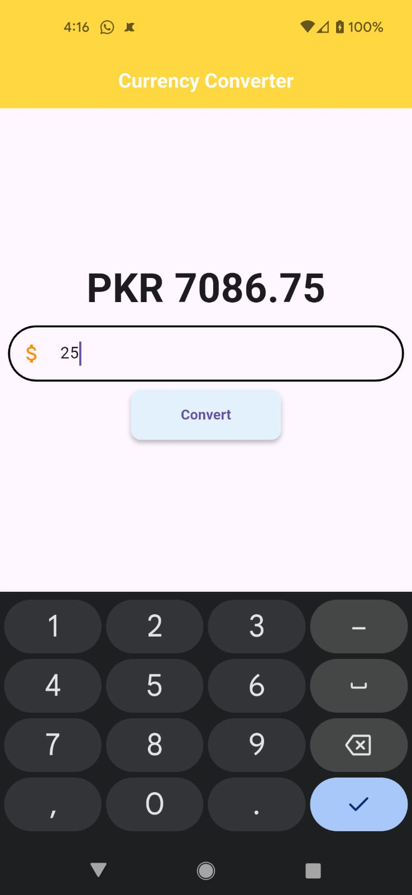
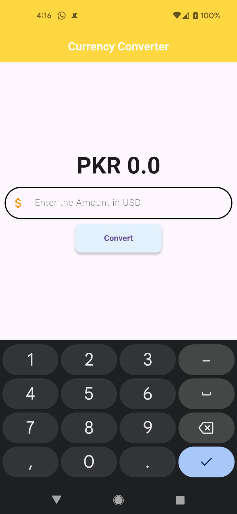

# 💰 Currency Converter

A simple Flutter app to convert USD to PKR instantly, built with beautiful Material Design.
---

## ✨ **Features**
- 🔢 Enter amount in USD
- 🇵🇰 Instantly get converted amount in PKR
- 📱 Clean and modern Material Design interface
- ⚡ Fast, offline calculation (uses a fixed rate)

---

## 📸 **Screenshots**





---

## 🚀 **Getting Started**

To run this project locally on your device or emulator:

```bash
# Clone the repository
git clone https://github.com/yourusername/currency-converter.git

# Move into the project folder
cd currency-converter

# Install dependencies
flutter pub get

# Run the app
flutter run
